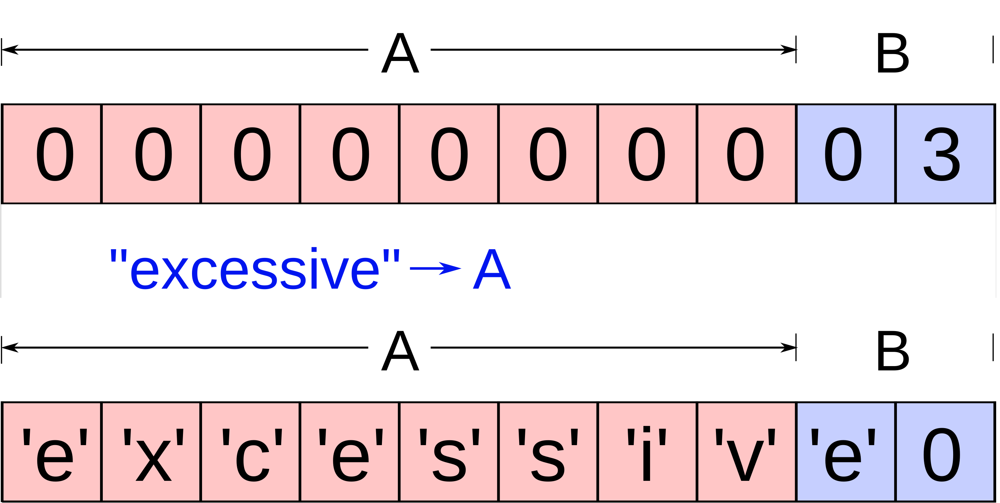
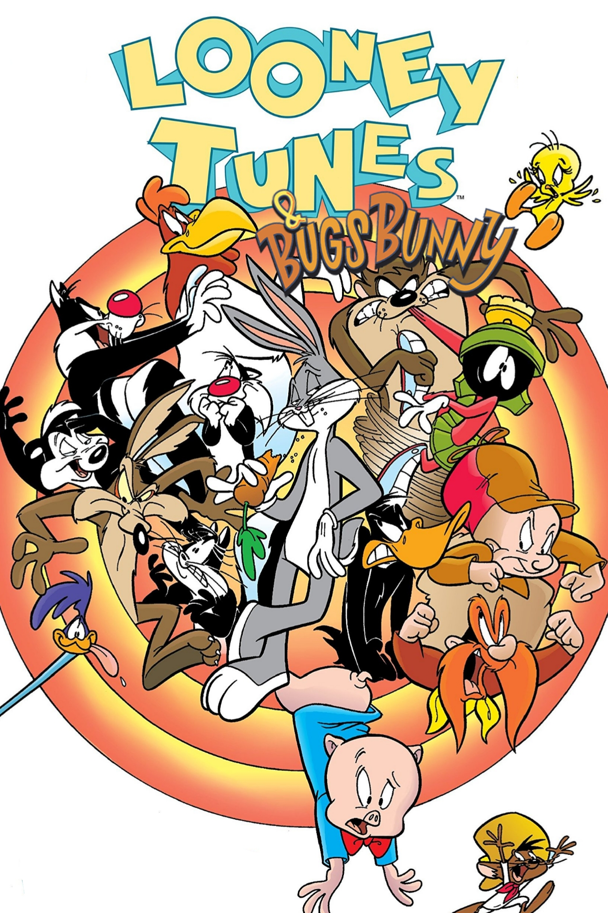

# Buffer Overflows

## What are buffer overflows

### The Basics (Jakob)


([image source](https://en.wikipedia.org/wiki/Buffer_overflow))

- Overwrites of memory through overfilling evaluated memory space

### Why can buffer overflows be bad

- Can lead to exploits where overwrites of variables and function pointers, along with the functions themselves, can cause unintended behavior.

### Methods

- Heap based exploits
- Stack Based Exploits 
https://stackoverflow.com/questions/4700998/explain-stack-overflow-and-heap-overflow-in-programming-with-example 

## Demos

- Working demo (Elias)
- Basic Variable Overwriting (Elias)
- Changing the function pointer (Elias)
    - using payloads to change pointers
- Adding shellcode to binary

### Demo 4 (Julien)
#### Stack Background ####
- **Stack Frame** is one procedure on the call stack
  - parameters
  - **return address** is where execution should return when stack frame is completed (can be exploited!)
  - old **frame pointer** (pointer from which other elements in the frame can be accessed)
  - local variables


### Protection Methods (Julien)

- **Address space layout randomization (ASLR)** randomizes the memory addresses of certain data points involved in a process each time it is run
- **Stack canaries** are known values placed around a buffer such that they would be corrupted in the event of a buffer overflow

### Morris Worm (Julien)

- famous exploit released November 2nd, 1988
    - used buffer overflows (among other exploitation methods)
    - used known source code of fingerd to overwrite return address in stack frame (same as demo 4)
    - executes code segment that creates a new shell (as root)

### Self built "broken" binaries (Elias)

#### Pwfeedback 

#### Loony Tunables 



([image source](https://www.imdb.com/title/tt8543208/))

Loony Tunables is a bug within the glibc package that doesn't account for malicious formatting of the `GLIBC_TUNABLES` variable. Glibc deals with .so, and the part that we're concerned about relates to malformed input for the c code to relate to the malformed pair. For example, usually the format for each tunable is `tunable1=AAA`. When it is instead misformed with an additional `=` sign, the pointer in line 247 doesn't change and it will overflow. 

```c
162 static void
163 parse_tunables (char *tunestr, char *valstring)
164 {
...
168   char *p = tunestr;
169   size_t off = 0;
170 
171   while (true)
172     {
173       char *name = p;
174       size_t len = 0;
175 
176       /* First, find where the name ends.  */
177       while (p[len] != '=' && p[len] != ':' && p[len] != '\0')
178         len++;
179 
180       /* If we reach the end of the string before getting a valid name-value
181          pair, bail out.  */
182       if (p[len] == '\0')
183         {
184           if (__libc_enable_secure)
185             tunestr[off] = '\0';
186           return;
187         }
188 
189       /* We did not find a valid name-value pair before encountering the
190          colon.  */
191       if (p[len]== ':')
192         {
193           p += len + 1;
194           continue;
195         }
196 
197       p += len + 1;
198 
199       /* Take the value from the valstring since we need to NULL terminate it.  */
200       char *value = &valstring[p - tunestr];
201       len = 0;
202 
203       while (p[len] != ':' && p[len] != '\0')
204         len++;
205 
206       /* Add the tunable if it exists.  */
207       for (size_t i = 0; i < sizeof (tunable_list) / sizeof (tunable_t); i++)
208         {
209           tunable_t *cur = &tunable_list[i];
210 
211           if (tunable_is_name (cur->name, name))
212             {
...
219               if (__libc_enable_secure)
220                 {
221                   if (cur->security_level != TUNABLE_SECLEVEL_SXID_ERASE)
222                     {
223                       if (off > 0)
224                         tunestr[off++] = ':';
225 
226                       const char *n = cur->name;
227 
228                       while (*n != '\0')
229                         tunestr[off++] = *n++;
230 
231                       tunestr[off++] = '=';
232 
233                       for (size_t j = 0; j < len; j++)
234                         tunestr[off++] = value[j];
235                     }
236 
237                   if (cur->security_level != TUNABLE_SECLEVEL_NONE)
238                     break;
239                 }
240 
241               value[len] = '\0';
242               tunable_initialize (cur, value);
243               break;
244             }
245         }
246 
247       if (p[len] != '\0')
248         p += len + 1;
249     }
250 }
```

In the code snippet above, if 

#### Tryhackme Shell Exploit + Explanation

- Hard for a cyber student of our level to understand
- We are given code that takes an input and puts it into a char array, but can overflow
- This overflow can be manipulated to output Assembly commands
- The program has the SUID bit, so it can be run as the user
- Through use of Assembly, you can switch users to the owner of the file
- The code exploited is this code, and the goal is to switch to user with ID 1002:
```c
#include <stdio.h>
#include <stdlib.h>

void copy_arg(char *string)
{
    char buffer[140];
    strcpy(buffer, string);
    printf("%s\n", buffer);
    return 0;
}

int main(int argc, char **argv)
{
    printf("Here's a program that echo's out your input\n");
    copy_arg(argv[1]);
}
```
- To exploit the code:
    - Use gdb to find the memory location of the buffer
        - First, 
    - As the input, put in an arbitrary number of 
